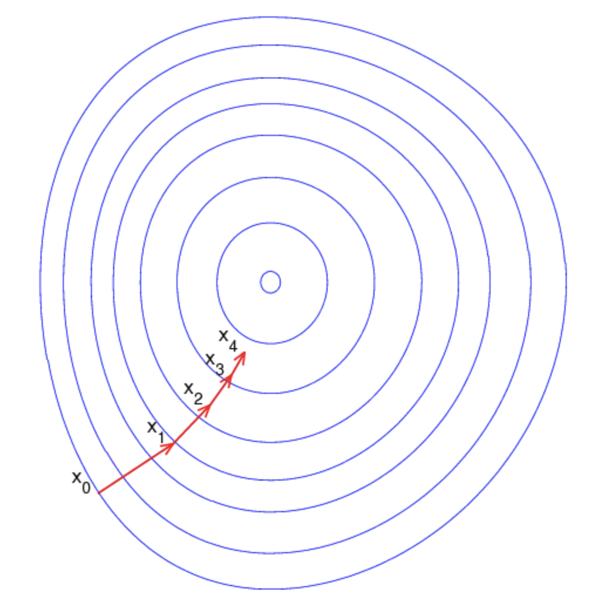

# 理论

梯度下降法是一个一阶最优化算法，也称为最速下降法。

如果实值函数 $F(x)$在点$a$处可微且有定义，那么函数$F(x)$在点$a$沿着梯度相反的方向$-\nabla F({a} )$ 下降最快。

令$b=a-\lambda \nabla F(a)$，当$\lambda >0$且为一个很小的值时，有$F(a)\ge F(b)$。

考虑到这一点，可以从函数$F$的局部最小值的初始估计$x_0$出发， 并考虑如下序列$x_0,x_1,...,x_n$使得$F(x_{n+1})\le F(n)$。如果顺利，随着$n$越来越大，是能收敛到最小值的。注意步长$\lambda$是可以改变的

上图中，蓝色为等高线，红色箭头为当前点的负梯度方向。沿着梯度下降方向，将最终到达碗底，即函数$F$值最小的点。

# 实现

[Sklearn实现随机梯度下降](../../sklearn/Sklearn实现随机梯度下降法.md)
